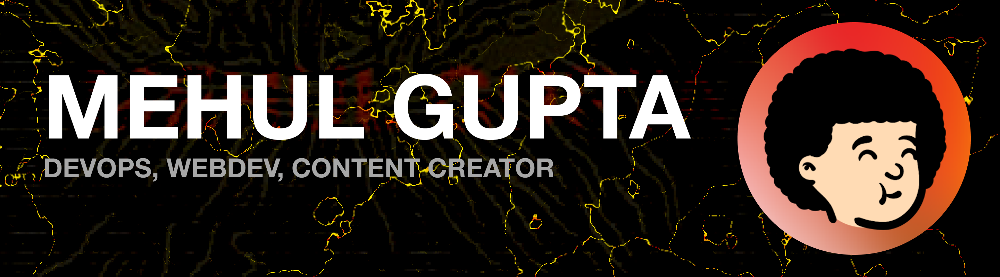

<h1 align="left">Hi, I'm Mehul Gupta 👋 🧑🏻‍💻</h1>

  

<h3 align="center">A passionate Full-Stack developer from India</h3>

- 🔭 I’m currently working on **Kubernetes**

- 🌱 I’m currently learning **DevOps and ML**

- 👨‍💻 All of my projects are available at [https://github.com/mehul79/](https://github.com/mehul79/)

- 💬 Ask me about **react, node js, ML**

- 📫 How to reach me **mehulrgupta@gmail.com**

<h3 align="left">Connect with me:</h3>

<h3>Things I code with</h3>

  
  
  
  

  
  
  

  
  

  
  
  
  
  
  
  

<!-- Core DL -->

<!-- Vision + CNN -->

<!-- Tools -->

<!-- Utilities -->

